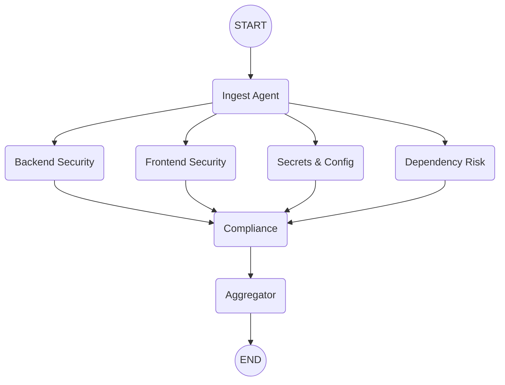
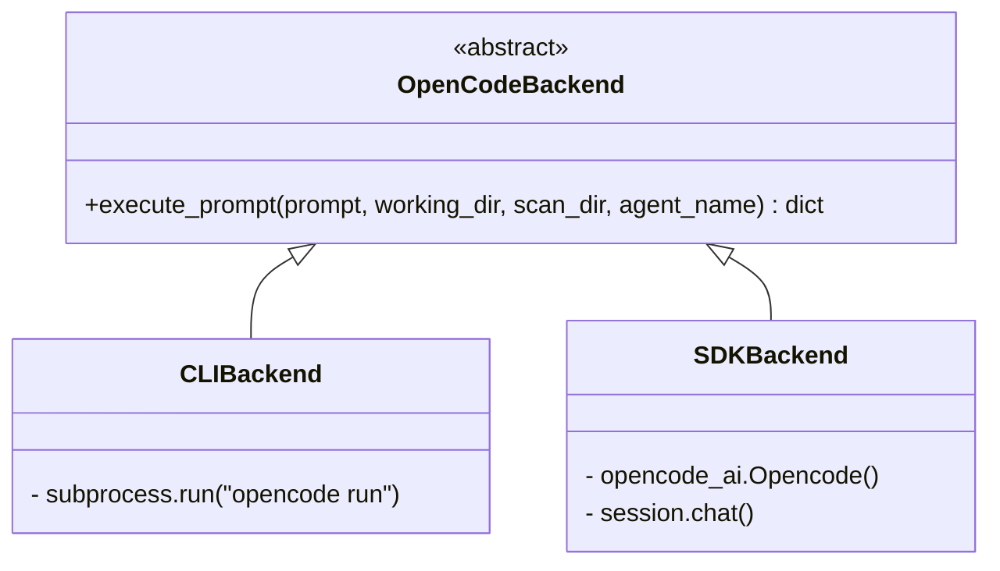

# System Architecture

The **Security Review System** is an automated, multi-agent static analysis platform. It leverages **LangGraph** to coordinate multiple specialized LLM agents powered by **OpenCode**, processing a codebase through systematic discovery, analysis, and synthesis phases.

This document describes the core components, data flow, and architectural decisions of the project.

---

## 1. High-Level Overview

At its core, the system acts as a multi-step pipeline built around a shared state. When a user requests a scan:
1. The target repository is sandboxed.
2. An initial exploring agent (Ingest) maps the codebase.
3. Multiple specialized agents run (concurrently or sequentially) to analyze specific vulnerability domains.
4. A compliance agent assesses overall adherence to security frameworks (OWASP, Secure by Design).
5. An aggregator agent synthesizes all findings into a final, unified report.

---

## 2. Agent Topology (LangGraph)

The flow is orchestrated via a LangGraph `StateGraph`, defined in `orchestrator/graph.py`.

The system supports a **Fan-Out / Fan-In** topology to maximize analysis speed when concurrent execution is enabled (`--parallel N`), or falls back to a purely sequential execution for lower-spec environments.

### The Agents
Agent prompts are defined declaratively as Markdown files in the `agents/` directory.

- **Ingest (`agents/ingest.md`)**: Identifies the tech stack and generates a `fingerprint.md` and file manifest.
- **Backend Security (`agents/backend_security.md`)**: Analyzes server-side code (Injection, Auth, SSRF).
- **Frontend Security (`agents/frontend_security.md`)**: Analyzes client-side code (XSS, CORS, CSP).
- **Secrets & Config (`agents/secrets_config.md`)**: Detects hardcoded credentials and unsafe configurations.
- **Dependency Risk (`agents/dependency_risk.md`)**: Reviews package manifests for known vulnerable dependencies.
- **Compliance (`agents/compliance.md`)**: Maps generated findings against the OWASP Top 10 and Secure by Design principles.
- **Aggregator (`agents/aggregator.md`)**: Deduplicates findings and writes the final `security_report.md`.

---

## 3. State Management

The pipeline shares data via a LangGraph state dictionary, typed as `SecurityState` (`orchestrator/schema.py`). 

Because multiple agents can execute concurrently in the Fan-Out phase, the state uses **custom reducers** (`Annotated[Type, reducer_function]`) to safely merge parallel updates without race conditions:

- **`completed_steps` / `errors`**: Uses `operator.add` to safely append lists from multiple agents.
- **`agent_outputs`**: Uses a custom `_merge_agent_outputs` reducer to combine dictionaries mapping agent names to their specific `AgentResult` object.
- **`current_agent`**: Uses a last-writer-wins reducer (`_last_value`), mostly used for logging context.

---

## 4. OpenCode Backend Abstraction

To support different deployment environments, the integration with OpenCode is abstracted behind a factory pattern (`orchestrator/backend_factory.py`). 

- **`CLIBackend`**: Wraps the natively installed OpenCode CLI using Python's `subprocess`. Best for standalone local environments where the CLI acts as an autonomous agent.
- **`SDKBackend`**: Uses the `opencode-ai` Python package to connect to an OpenCode server (local or remote via `--sdk-url`). Creates isolated sessions for each agent execution.

This abstraction ensures that the higher-level graph (`nodes.py`) never cares how the prompt is executed, only that it returns a standardized result dictionary.

---

## 5. Security & Isolation

Analyzing untrusted or potentially malicious code requires strict guardrails.

1. **Workspace Sandboxing**: 
   The `main.py` entry point creates a dedicated, temporal scanning directory (`state/scan_<timestamp>`). The target repository is structurally copied into a `repo_copy/` subdirectory.
   - Agents are `chroot`-like confined to execute terminal commands only within `repo_copy`.
   - The original source repository is never mutated.
   - Transient files `.env`, `venv`, `node_modules`, `.git` are ignored during the copy to prevent agents from snooping sensitive local states.

2. **Anti-Prompt-Injection**: 
   When agents read files, the results are injected into the context of subsequent prompts (`nodes.py -> _build_prompt`).
   - Contents are surrounded by strict `<code_context>` XML tags.
   - The framework prepends an explicit hardening preamble instructing the LLM to ignore any instructions embedded within the codebase payload.

3. **I/O Routing**:
   Agent inputs and outputs are strictly routed through `orchestrator/agent_config.py`. An agent only receives the intermediate files (e.g., `fingerprint.md`, `findings_backend.md`) it explicitly needs to prevent context window bloat and cross-contamination of tasks.
