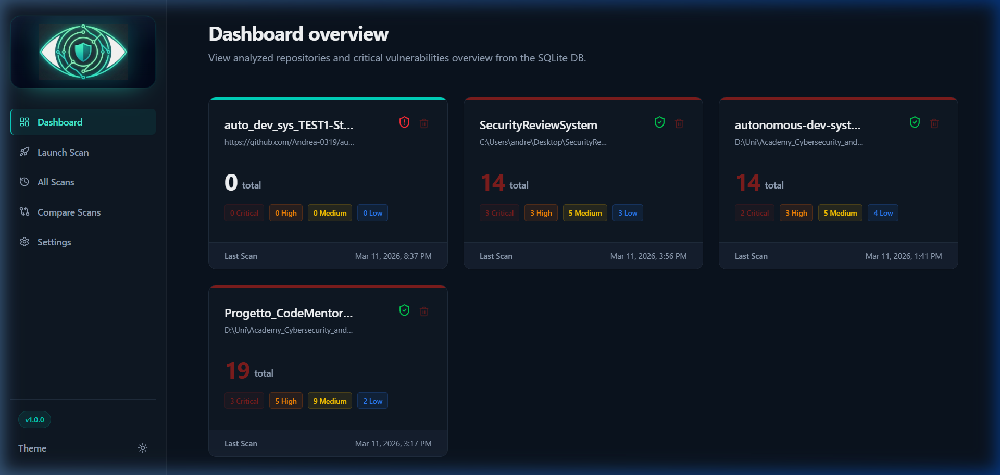

# Security Review System - MVP

[](LICENSE)

An automated, locally-run, multi-agent security review system powered by OpenCode and LangGraph.

Analyze any repository — **local directory** or **remote Git URL** — through specialized security agents, generate a consolidated report, and browse findings through an interactive dashboard.



## Quick Start

### 1. Clone

```bash
git clone https://github.com/Andrea-0319/Reposec.git
cd Reposec
```

### 2. Setup

The setup script creates a virtual environment, installs all dependencies, builds the frontend, and configures `.env`.

| OS | Command |
|---|---|
| **Windows** | `setup.bat` |
| **macOS / Linux** | `chmod +x setup.sh && ./setup.sh` |

### 3. Launch the Dashboard

| OS | Command |
|---|---|
| **Windows** | Double-click `start_dashboard.bat` |
| **macOS / Linux** | `./start_dashboard.sh` |

Then open **http://localhost:8000** in your browser.

## Prerequisites

- Python 3.10+
- Node.js 20+
- **Git** (required for remote repository scanning)
- **[OpenCode](https://github.com/opencode-ai/opencode)**: either the CLI on your `PATH`, or an accessible SDK server

## What it does

The review pipeline is orchestrated by LangGraph and includes these agents:

| Agent | Responsibility |
|---|---|
| **Ingest** | Explores the repo, identifies the stack, builds the initial footprint |
| **Backend Security** | Injection, SSRF, broken access control, auth weaknesses |
| **Frontend Security** | XSS, CORS, CSP weaknesses |
| **Secrets & Config** | Hardcoded credentials, insecure runtime config |
| **Dependency Risk** | Risky or outdated packages in manifests |
| **Compliance** | OWASP Top 10 (2025) and Secure by Design mapping |
| **Aggregator** | Deduplication and final `security_report.md` generation |

Key characteristics:
- **Sandboxed analysis** — the target repo is copied before agents run
- **Parallel fan-out / fan-in** — up to 4 agents run concurrently
- **Flexible backend** — supports local CLI and SDK-based remote execution
- **Persistent history** — projects, scans, and findings stored in SQLite
- **Local dashboard** — launch scans, inspect reports, compare findings

## Tech Stack

- **Backend**: Python, LangGraph, FastAPI, SQLite
- **Frontend**: React, Vite, TypeScript, Tailwind CSS, Recharts
- **LLM Execution**: OpenCode CLI or OpenCode SDK

## CLI Usage

```bash
# Activate the virtual environment first
# Windows:  .venv\Scripts\activate
# Unix:     source .venv/bin/activate

# Scan a local repository
python main.py "/path/to/your/repo"

# Scan a remote Git repository (shallow-cloned automatically)
python main.py "https://github.com/owner/repo"

# Scan a specific branch
python main.py "https://github.com/owner/repo" --branch develop

# Run with up to 4 parallel agents
python main.py "/path/to/your/repo" --parallel 4

# Start the dashboard server only (no scan)
python main.py --dashboard

# Override the model
python main.py "/path/to/your/repo" --model "opencode/glm-5-free"

# Use the SDK backend
python main.py "/path/to/your/repo" --backend sdk --sdk-url "http://host:54321"

# Copy the final report into the repo root
python main.py "/path/to/your/repo" --copy-report
```

### CLI Options

| Flag | Description |
|---|---|
| `--parallel N` | Number of parallel agents (1–4, default: 1) |
| `--branch NAME` | Git branch/tag to clone (remote repos only) |
| `--model MODEL` | Override the OpenCode model |
| `--backend cli\|sdk` | Choose execution backend |
| `--sdk-url URL` | SDK server URL |
| `--timeout SECS` | Per-agent timeout in seconds |
| `--copy-report` | Copy report to the analyzed repo root |
| `--no-dashboard` | Skip auto-opening the dashboard after scan |
| `--dashboard` | Start dashboard server only |

## Dashboard

The React-based dashboard is served by FastAPI at `http://localhost:8000`.

### Pages

- **Dashboard** — overview of projects and recent scan activity
- **Launch Scan** — browser-based scan form (local paths and remote Git URLs with branch discovery)
- **All Scans** — global historical scan list
- **Compare Scans** — side-by-side diff of introduced, resolved, and unchanged findings
- **Settings** — preferences and backend connectivity checks

### Capabilities

- Browse projects and scan timelines
- Detailed scan reports with severity cards and parsed findings
- Filter findings by severity and OWASP category
- Launch scans from the UI targeting local or remote repositories
- Dynamic branch discovery for Git URLs
- Delete individual scans or full projects
- Compare two scans to spot regressions
- Configurable model, backend, timeout, and parallelism
- Auto-refresh while a scan is running

## Configuration

Copy `.env.example` to `.env` (the setup script does this automatically):

```dotenv
OPENCODE_BACKEND=cli
# OPENCODE_SDK_URL=http://192.168.1.100:54321
OPENCODE_MODEL=opencode/minimax-m2.5-free
OPENCODE_TIMEOUT=1800
LOG_LEVEL=INFO
```

## Output

Each scan writes artifacts into `state/scan_<timestamp>/`:

- `security_report.md` — consolidated report
- `fingerprint.md` — stack fingerprint
- `findings_*.md` — per-agent findings
- `logs/` — execution logs
- `repo_copy/` — sandboxed repository clone

## Testing

The project includes automated tests for the CLI bootstrap flow, orchestration graph, database layer, report parsing, and dashboard API.

```bash
# Install dev dependencies
pip install -r requirements-dev.txt

# Run the full test suite
pytest tests/ -v
```

## Project Structure

```
SecurityReviewSystem/
├── agents/          # Markdown prompt templates for each review agent
├── dashboard/       # FastAPI backend (API, DB, report parsing)
├── frontend/        # React SPA (Vite + TypeScript + Tailwind)
├── orchestrator/    # LangGraph workflow, nodes, OpenCode integration
├── knowledge/       # Reference material (OWASP, Secure by Design)
├── tests/           # Pytest test suite
├── main.py          # CLI entry point
├── config.py        # Configuration
├── setup.sh/.bat    # Automated setup scripts
└── start_dashboard.sh/.bat  # Dashboard launcher scripts
```

## Contributing

Contributions are welcome! See [CONTRIBUTING.md](CONTRIBUTING.md) for guidelines.

## License

This project is licensed under the MIT License — see the [LICENSE](LICENSE) file for details.
